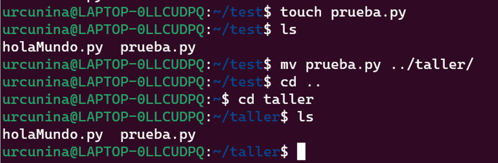

**ACTIVIDAD 1**

**Tipo actividad: Instalación de WSL**

**Instalación de WSL:**

Para instalar WSL seguiremos la guía del link: 

[Instalación de WSL | Microsoft Learn](https://learn.microsoft.com/es-es/windows/wsl/install) 

También se puede con el video:www.youtube.com https:///watch?v=f\_CC4GZ0UnY

Se instalará Ubuntu 20.04 (también se puede el 18.04) con el fin de tener el mismo sistema operativo de base.

Verificación: 

Al finalizar la instalación abrir una consola y ejecutar el comando ls / , se debe ver en consola la estructura de ficheros de la versión de Linux instalada. 

Posteriormente se explicarán algunos comandos de la consola de Linux:

**Algunos comandos para conocer la terminal**

Los comandos de Linux se ejecutan en el Terminal pulsando Enter al final de la línea. Puedes ejecutar comandos para realizar diversas tareas, desde la instalación de paquetes hasta la gestión de usuarios y la manipulación de archivos.

La sintaxis general de un comando Linux es la siguiente:

Nombredelcomando \[opcion(es)\] \[parametro(s)\]

Los comandos Linux pueden contener una opción o un parámetro. En algunos casos, pueden ejecutarse sin ellos. Estas son las tres partes más comunes de un comando:

* CommandName es la regla que deseas ejecutar.  
* Option o flag modifica el funcionamiento de un comando. Para ejecutarla, utiliza guiones (-) o guiones dobles (—).  
* Parameter o argument especifica cualquier información necesaria para el comando.

Todos los comandos de Linux distinguen entre mayúsculas y minúsculas.

Lista de comandos básicos, para practicar a medida que se explican con los estudiantes.

1. Comando sudo: es la abreviatura de super usuario, permite realizar tareas con permisos de root (máxima autoridad en el computador), todo comando que sea antecedido por sudo se ejecutará con privilegios elevados.  
2. Pwd: permite conocer cuál es la ruta de trabajo actual (carpeta en la que nos encontramos)  
3. cd es el comando para navegar entre carpetas desde la terminal, permite movernos a diferentes directorios, por ejemplo cd /home, o cd /usr , al ejecutarlos veremos cómo la ruta en la consola cambia. Para subir un directorio podemos emplear el comando cd ..   
4. ls permite listar los archivos y carpetas dentro de un directorio, se le pueden agregar opciones, por ejemplo ls \-l permite ver en forma de lista o ls \-la los publica en forma de lista y muestra archivos ocultos. En Linux los archivos ocultos son aquellos cuyo nombre empieza con un punto. Para listar directorios con subdirectorios y contenidos se puede emplear ls \-R (recursivo).  
5. cat: este comando permite imprimir en la salida estándar (consola) el contenido de los archivos. Es útil para visualizar rápidamente archivos y configuraciones  
6. cp: permite copiar un archivo en otro, por ejemplo cp nombrearchivo1.txt nombrearchivo2.txt nombrearchivo3.txt /inicio/nombredeusuario/Documentos 
7. mv: permite mover archivos de un lugar a otro  
8. mkdir: crea directorios, por ejemplo mkdir micarpeta crearía una carpeta llamada micarpeta.  
9. Touch: permite crear archivos vacíos, por ejemplo touch holamundo.py, si inmediatamente después se usa el comando ls se puede apreciar el archivo holamundo.py creado.  
10. Top: permite ver los procesos en ejecución con su consumo de recursos, para salir se debe pulsar escape o q.

En Linux es común que Python venga pre instalado, como actividad se sugiere que los estudiantes creen un archivo de “hola mundo” y lo ejecuten empleando la consola de Linux: python3 hola\_mundo.py, para editar el contenido del fichero puede emplear vim en consola. Si vim no se encuentra instalado, oriente a los estudiantes a la instalación utilizando el comando: sudo apt install vim 

